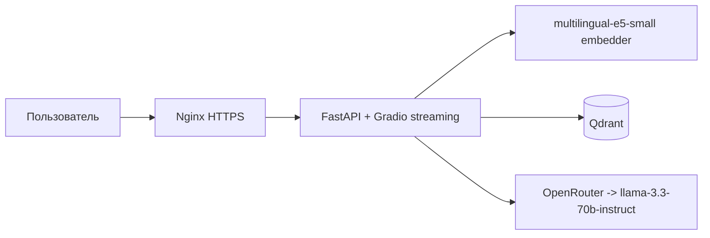
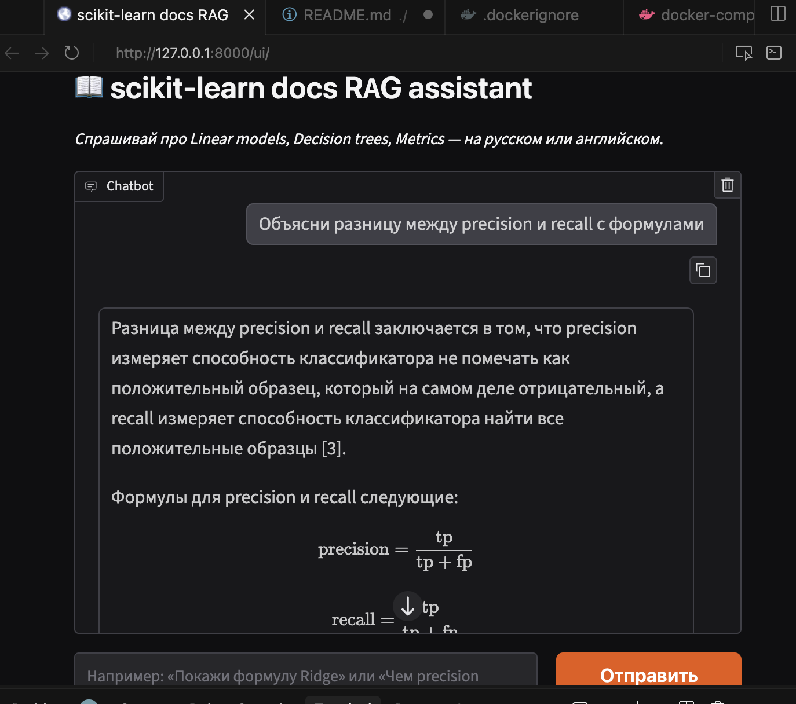

# scikit-learn docs RAG assistant

AI-ассистент по официальной документации scikit-learn. Задаёте вопрос
на естественном языке — получаете ответ с цитатами из документации.

- **Live demo:** https://176-108-248-151.nip.io/ui/
- **Swagger UI:** https://176-108-248-151.nip.io/docs
- **Health-check:** https://176-108-248-151.nip.io/health

## Архитектура



## Метрики

Замеры на реальной системе (10 вопросов golden-датасета,
sklearn-модули + about.md, llama-3.3-70b-instruct,
`notebooks/rag_eval.ipynb`):

| Метрика | Значение | Что измеряет |
|---|---|---|
| Recall@4 | **1.00** | retriever возвращает релевантный URL во всех 10 случаях |
| Faithfulness | **0.92** | LLM-судья: ответ не противоречит контексту |
| Response Relevancy | **0.83** | LLM-судья: ответ по делу, не уходит в сторону |
| Avg retrieval | **50 ms** | embed + Qdrant top-4 |
| Avg LLM (no stream) | **7.0 s** | invoke() через OpenRouter |
| TTFT (streaming) | **<1 s** | stream(), время до первого токена |

## Локальный запуск

```bash
cp .env.example .env   # задай LLM_API_KEY
docker compose up -d qdrant
docker compose run --rm app sh -c \
  "python -m app.scripts.load_corpus && python -m app.scripts.index_corpus"
docker compose up -d app
```

Откройте http://127.0.0.1:8000/ui/

## Скриншот



## Для резюме

> RAG-сервис над документацией scikit-learn на FastAPI + LangChain
> LCEL + Qdrant + multilingual-e5-small. Streaming-чат в Gradio
> (TTFT < 1s через chain.stream), оценка качества через RAGAS на
> golden-датасете (Recall@4 1.00, Faithfulness 0.92). LLM-провайдер
> абстрагирован через OpenAI-совместимый endpoint — меняется одной
> правкой `app/config.py`.

## Стек

Python 3.11 · FastAPI · Gradio · LangChain · Qdrant · multilingual-e5-small · OpenRouter · Docker · GitHub Actions · nginx
