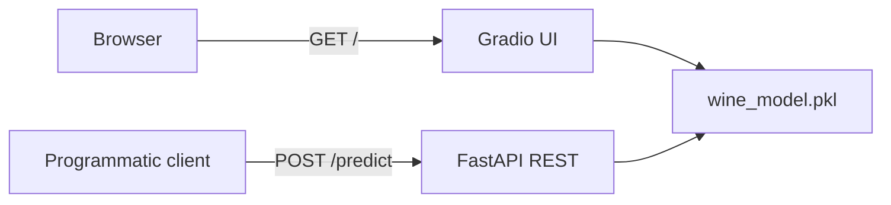
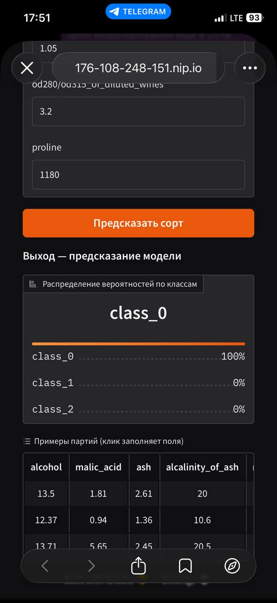

# task-api: ML-эндпоинт для классификации вина

Сервис на FastAPI + Gradio, который по 13 химическим показателям партии вина определяет сорт винограда (`class_0`, `class_1`, `class_2`). Принимает запросы как через REST (JSON), так и через браузерный Gradio-интерфейс.

- **Live demo:** https://176-108-248-151.nip.io/
- **Swagger UI:** https://176-108-248-151.nip.io/docs
- **Health-check:** https://176-108-248-151.nip.io/health

## Что внутри

- `wine-train/wine_train_practice.ipynb` + `wine-train/wine_train_solution.ipynb` — обучение `DecisionTreeClassifier` на `sklearn.datasets.load_wine` (label noise 15% в train, `max_depth=4` через `GridSearchCV`). Ноутбуки обучаются отдельно; готовый артефакт копируется в `models/`
- `app/main.py` — FastAPI с lifespan-загрузкой модели + REST `/predict` + Gradio на `/`
- `models/wine_model.pkl` — сериализованный `DecisionTreeClassifier` (лежит в git, нужен для CI/Docker)
- `tests/` — pytest-тесты на REST-эндпоинт и Gradio-роут
- `Dockerfile` + `.github/workflows/` — CI/CD, автодеплой на VPS через GHCR + SSH

## Архитектура



## Как запустить локально

```bash
conda create -n task-api python=3.11 -y
conda activate task-api
pip install -r requirements.txt

# модель уже в models/wine_model.pkl; при необходимости переобучите ноутбуком
# и скопируйте: cp wine-train/wine_model.pkl models/

cp .env.example .env   # задай LLM_API_KEY (обязательно)
uvicorn app.main:app --reload
```

Откройте `http://127.0.0.1:8000/` для Gradio, `http://127.0.0.1:8000/docs` для Swagger.

## Скриншот



## Стек

Python 3.11 · FastAPI · Pydantic v2 · scikit-learn 1.6 · Gradio 5 · pytest · Docker · GitHub Actions · GHCR · nginx · Let's Encrypt
